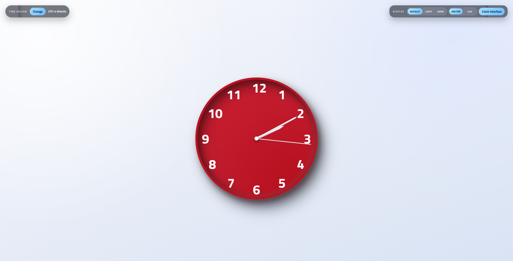
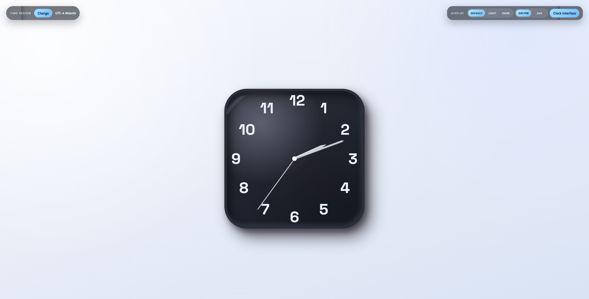
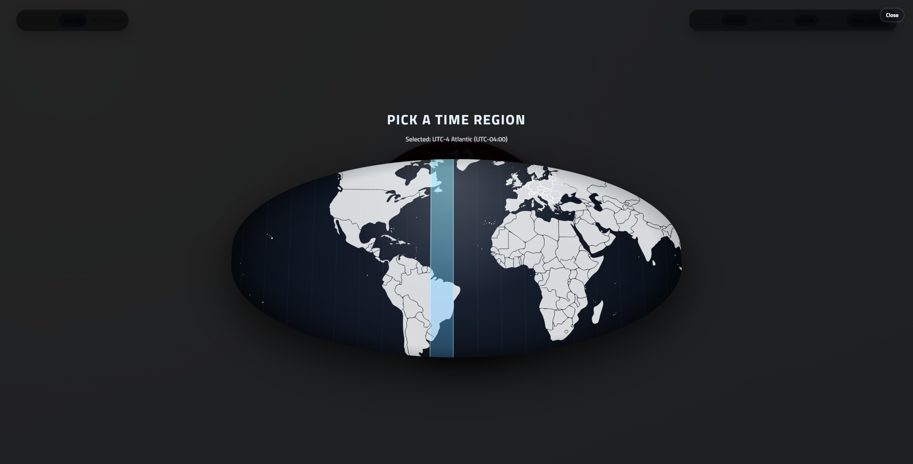

# CSS Clock Layout

A customizable, single-page interactive clock built with vanilla JS and CSS.



## Features

### 🎨 Custom Interface
Switch between multiple clock face styles including:
- **Crimson Round**: Classic bold red face.
- **Graphite Square**: Rounded-square industrial look.
- **Ivory Soft**: Warm studio instrument style.
- **Midnight Matte**: Smooth low-glare dark finish.



### 🌍 Region Selector
Interactive scrolling world map to select your timezone. The clock automatically adjusts to the chosen region (from Samoa to New Zealand).



### ⚙️ Smart Controls
- **Auto Dark Mode**: Toggles between Light, Dark, and Auto (system preference).
- **Tab Title Time**: Displays the current time directly in the browser tab (supports both 12H AM/PM and 24H formats).

## Project Structure

```text
.
├── index.html                # Markup only
├── assets
│   ├── css
│   │   └── style.css         # All styles, grouped by section
│   ├── js
│   │   └── app.js            # App logic, grouped by feature
│   ├── img
│   │   └── BlankMap-World_grey.svg
│   ├── audio
│   │   └── tick.mp3
│   └── unused                # Legacy/unused assets kept for reference
│       ├── BlankMap-World_gray.svg
│       ├── clockimg.png
│       └── hand.png
└── README.md
```

## Run Locally

Open `index.html` in a browser.

## Deployment

This project is ready for GitHub Pages from the repository root (`main` branch, `/` folder).
